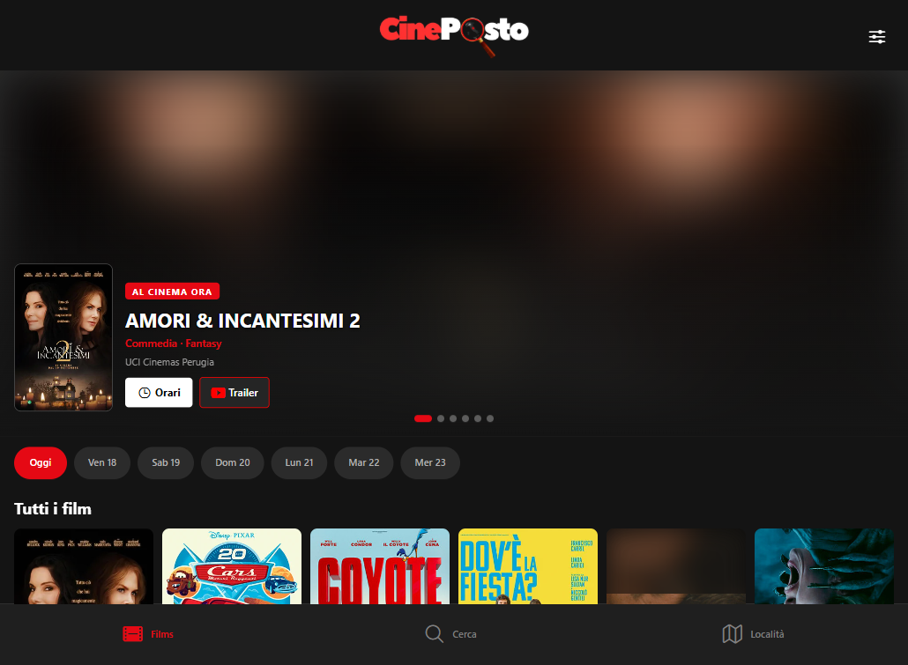

# CinePosto

**La programmazione dei cinema dell'Umbria in un posto solo.** Uno scraper Python raccoglie ogni
notte i film in cartellone, un backend FastAPI li serve via REST e un'app React Native li mostra
su web, iOS e Android dalla stessa codebase. Nessuna registrazione: apri e vedi cosa danno stasera.

[](https://github.com/Jysek/CinePosto/actions/workflows/ci.yml)




## Com'è fatto

```
cineposto/
├── scraper/   pipeline Python: legge i siti dei cinema → JSON
├── backend/   API FastAPI su SQLite: importa i JSON e li espone via REST
├── app/       app React Native (Expo): consuma l'API, gira su web e mobile
└── docs/      documentazione tecnica e del corso
```

Una pipeline in tre stadi collegati da **contratti espliciti**: file JSON tra scraper e backend,
API REST tra backend e app. Ogni stadio si testa da solo — **180 test** (149 scraper, 31 backend).

| Componente | Tecnologie | Cosa fa |
|---|---|---|
| `scraper/` | Python 3.12, requests, BeautifulSoup, Wikidata SPARQL | un connettore per cinema (pattern Strategy), normalizzazione dei titoli, dedup, arricchimento metadati |
| `backend/` | FastAPI, SQLAlchemy 2.0, SQLite, Pydantic | architettura a strati (routers → services → repositories → models), 11 endpoint REST, seed idempotente |
| `app/` | Expo SDK 57, React Native 0.86, React Navigation | home con film di oggi, dettaglio film, ricerca con debounce, mappa delle sale, versione web identica |
| infra | Docker Compose, GitHub Actions, Caddy | Docker per sviluppo e produzione, CI che testa dentro le immagini, HTTPS gestito da Caddy |

## Avvio rapido

Serve solo **Docker**: Python 3.12 sta dentro l'immagine. Su Windows si può anche fare
doppio clic su `dev.cmd`.

```bash
git clone https://github.com/Jysek/CinePosto.git && cd CinePosto

make dev     # accende Docker se serve, avvia backend e app (browser + telefono)
make scrape  # scarica la programmazione aggiornata dai siti dei cinema
make seed    # carica i dati nel database
make test    # 31 test backend dentro il container
make help    # tutti i comandi
```

App (web e telefono): con `make dev` è già avviata con l'indirizzo giusto. Per avviarla da sola:

```bash
cd app && npm install
EXPO_PUBLIC_API_BASE="http://<IP-LAN>:8000/api/v1" npx expo start
```

`localhost` non funziona dal telefono: serve l'IP del computer sulla rete locale
(`ipconfig | findstr IPv4`). Setup dettagliato, firewall e problemi noti:
[`docs/development-windows.md`](docs/development-windows.md).

## Stato e roadmap

**Funziona end-to-end**: scraping delle 8 sale coperte, backend, app su web, iOS e Android. La CI testa
backend, scraper e build web a ogni push.

- ✅ Scraper, backend e app completi e collegati
- ✅ Ricerca in-app, mappa delle sale, orari per data
- ✅ Docker per sviluppo e produzione, CI, deploy pronto e verificato in locale
- 🔄 **Estensione a tutte le sale dell'Umbria**: quelle implementate sono 8 su 30 sale note
  (21 comuni con almeno una sala), come tracciato in
  [`docs/scraper/copertura.md`](docs/scraper/copertura.md). Un connettore alla volta, con
  una tabella di copertura che dichiara per ogni sala se ha una fonte leggibile
- ⏳ Avviso "dati non aggiornati" nell'app
- ⏳ Deploy sulla VPS (procedura pronta in [`docs/deploy.md`](docs/deploy.md))
- ❌ Fuori scope per scelta: account utente, acquisto biglietti in-app, notifiche

## Documentazione

Tutto in [`docs/`](docs/index.md). Da dove partire:

| Documento | A cosa serve |
|---|---|
| [`docs/panoramica.md`](docs/panoramica.md) | Il sistema spiegato da cima a fondo |
| [`docs/development-windows.md`](docs/development-windows.md) | Setup su Windows con Docker, telefono, firewall |
| [`docs/development.md`](docs/development.md) | Setup nativo (venv + npm), test, lint, variabili d'ambiente |
| [`docs/deploy.md`](docs/deploy.md) | Come va in produzione (VPS, Caddy, timer, backup) |
| [`docs/backend/api.md`](docs/backend/api.md) | Contratto API completo |

## Crediti e licenza

CinePosto è nato come progetto di gruppo del corso di Ingegneria del Software (ITS Umbria
Academy, a.a. 2025/2026) ed è proseguito come progetto personale di Andrea Cestelli.
Autori originali, team **RepCode**: Emanuele Ceccariglia, Elio Casciola, Andrea Cestelli,
Yonas Burka. Repository di origine: [Emanuele2006iii/CinePosto](https://github.com/Emanuele2006iii/CinePosto).

Codice con licenza **MIT** (vedi [`LICENSE`](LICENSE)). Metadati dei film da **Wikidata** (CC0);
programmazione, poster e marchi restano dei rispettivi cinema e il progetto non è affiliato a
nessuno di essi: dettagli in [`NOTICE`](NOTICE). Lo scraping rispetta `robots.txt`, applica rate
limiting, gira una volta al giorno e si identifica con uno User-Agent che riporta repo e contatto.
